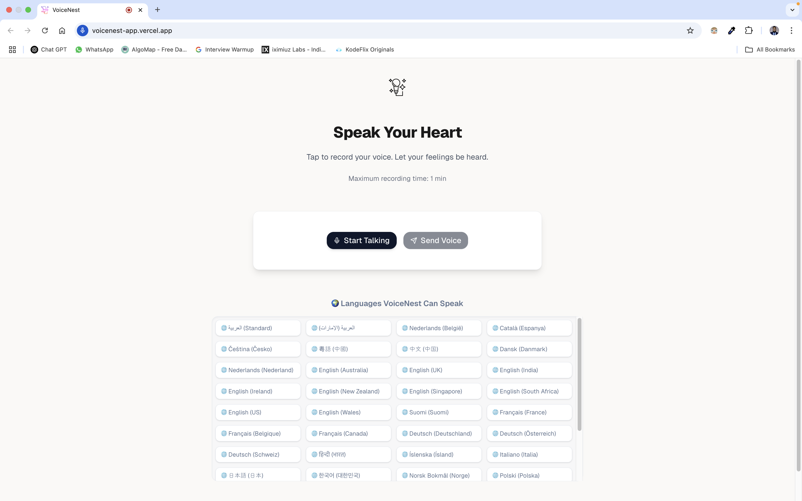
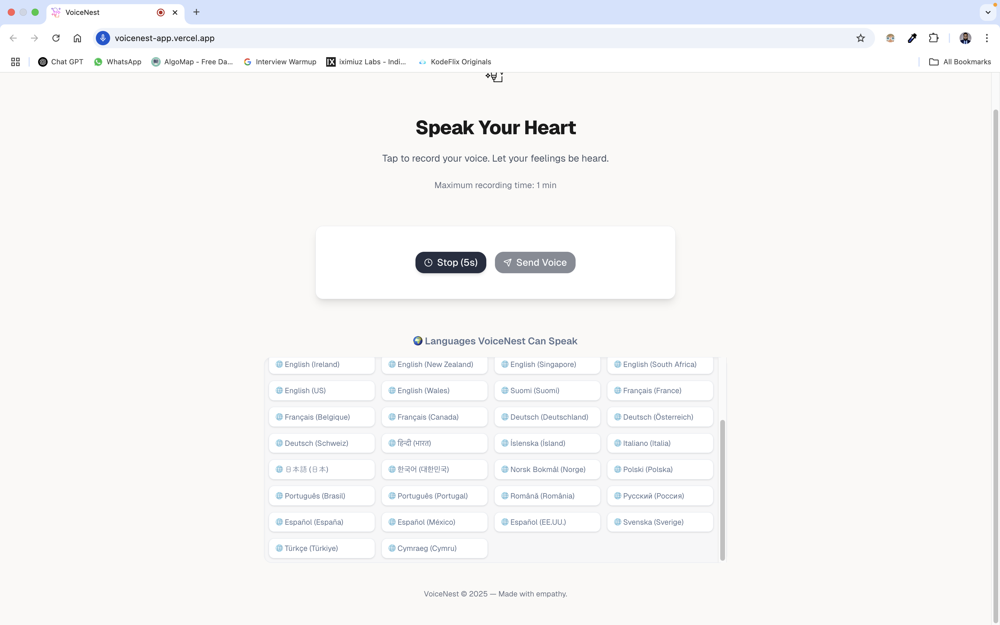
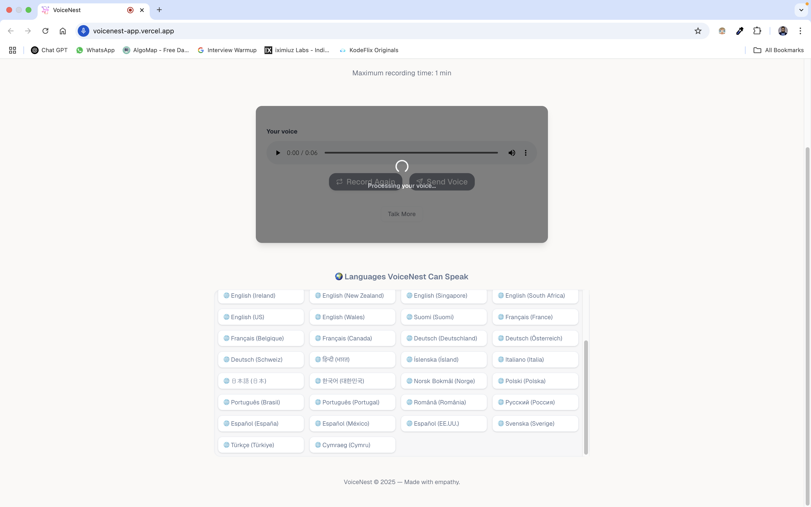
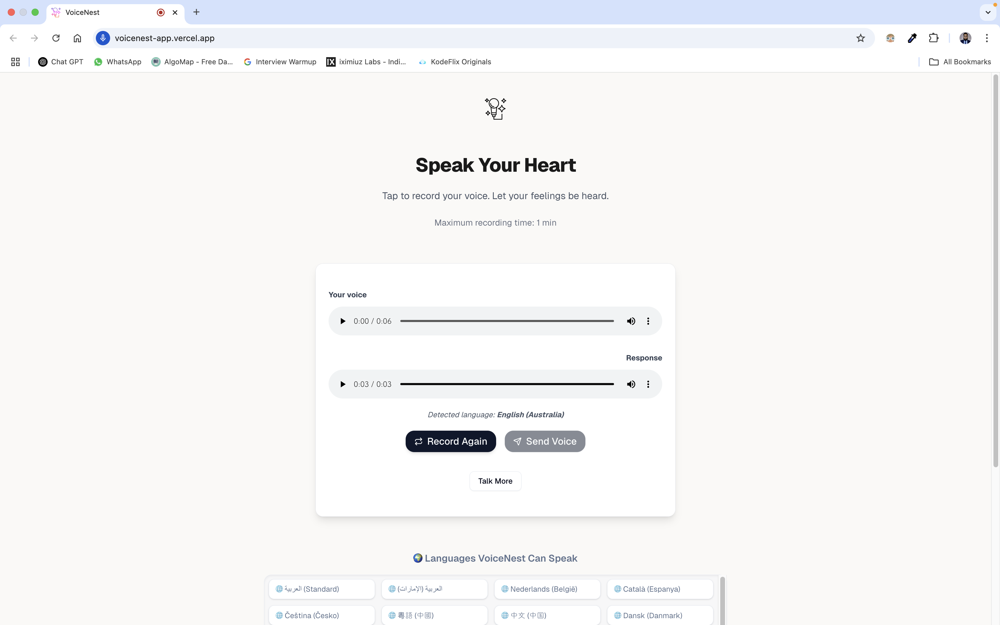

# 📱 VoiceNest App (Frontend)

> **Empathetic AI Companion — Speak Your Heart**
>
> A modern, voice-based emotional support app for elderly users, built with **Next.js**, **shadcn/ui**, and **Framer Motion**. Powered by AWS Lambda backend.

---

## 🌐 Live Demo

- **App**: [https://voicenest-app.vercel.app](https://voicenest-app.vercel.app)

---

## ✨ Features

- 🎙️ Voice recording up to 60 seconds
- 🤖 AI-generated empathetic replies (via Cohere)
- 🌍 Supports 40+ spoken languages via Amazon Polly
- 🎧 Play back your voice and the AI's response
- 🧠 Language detection & multilingual translation
- 🎁 Delightful UI/UX with smooth animations

---

## 🔧 Tech Stack

- **Framework**: Next.js 14
- **UI Components**: [shadcn/ui](https://ui.shadcn.com)
- **Animations**: Framer Motion
- **Icons**: Lucide React
- **Recording**: MediaRecorder API + WAV conversion
- **API Endpoint**: AWS Lambda (via API Gateway)

---

## 🚀 Getting Started

### 1. Clone the repo

```bash
git clone https://github.com/shadreza/voicenest-app.git
cd voicenest-app
```

### 2. Install dependencies

```bash
npm install
```

### 3. Run locally

```bash
npm run dev
```

### 4. Set environment variable

Create a `.env.local` file:

```env
NEXT_PUBLIC_API_URL=https://<your-api-id>.execute-api.<region>.amazonaws.com
```

---

## 📁 Key Files

### `/app/page.tsx`

- Full implementation of the **AudioRecorder** component
- Handles recording, conversion, playback, and API interaction

### `/components/SupportedLanguagesTicker.tsx`

- Displays supported languages in a **scrollable animated grid**

---

## 📸 Screenshots

### 🏠 Home Interface



### 🎙️ Recording in Progress



### ⏳ Waiting for Response



### 🤖 AI Reply with Detected Language



---

## 🌍 Supported Languages

VoiceNest currently supports **40+ languages** via Amazon Polly.
Displayed using an animated grid in the UI for accessibility and clarity.

---

## ⚙️ API Contract

**POST** `${NEXT_PUBLIC_API_URL}/voice`

- **FormData**: `audio` (Blob, WAV format)
- **Returns**: `audio/mpeg` stream with `x-language` header

---

## 💡 VoiceNest Vision

VoiceNest brings emotional companionship to elderly individuals through human-like, multilingual voice interactions—without needing screens, typing, or apps.

---

## 👤 Author

**Muhammad Shad Reza**
🌐 [LinkedIn](https://linkedin.com/in/shadreza100) • 🛠️ [GitHub](https://github.com/shadreza)

---

## 🛣️ Next Steps

- Add emotion-specific voice modulation
- Add history of conversations
- Extend to mobile PWA / More Better AI Models Integration
